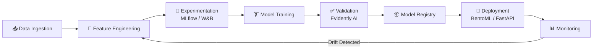

<div align="center">

<!-- Animated Name Banner -->


<!-- Typing Animation -->
<a href="https://git.io/typing-svg">
  
</a>

<br/>

<!-- Profile Badges -->
[](https://linkedin.com/in/jayant-yadav-a22b98283)
[](https://instagram.com/jayant.yadav01)
[](https://x.com/@Jaynt_69)
[](https://github.com/CoderJaynt)

</div>

---

## 💫 About Me

```python
class JayantYadav:
    def __init__(self):
        self.name       = "Jayant Yadav"
        self.role       = "ML Engineer & AI Builder"
        self.education  = "B.Tech Undergraduate"
        self.location   = "India 🇮🇳"
        self.achievement = "🏆 CodeAstra Hackathon Winner"

    def current_focus(self):
        return [
            "Advanced ML & Deep Learning",
            "AI Agents & RAG-based Systems",
            "MLOps — CI/CD for ML, experiment tracking, model serving",
            "Feature Engineering & Model Optimization",
            "Production-ready ML Projects",
        ]

    def open_to(self):
        return ["Collaborations", "Internships", "Open Source", "Learning"]
```

---

## 🚀 Tech Stack

### 🧠 Machine Learning & Deep Learning


### 📦 MLOps & Experiment Tracking


### ☁️ Cloud & Deployment


### 🌐 Frameworks & APIs


### 🗄️ Data & Databases


### 🔧 Dev Tools


---

## 🔬 MLOps Pipeline



---

## 📊 GitHub Stats

<div align="center">


<br/>


</div>

---

## 🏆 GitHub Trophies

<div align="center">


</div>

---

## 🔝 Top Contributed Repos

<div align="center">


</div>

---

## ✍️ Dev Quote of the Day

<div align="center">


</div>

---

## 📈 Contribution Graph

<div align="center">

[](https://github.com/CoderJaynt)

</div>

---

<div align="center">

<!-- Snake Animation -->


</div>

---

<div align="center">

### 🤝 Let's Connect & Build Something Awesome!

[](https://linkedin.com/in/jayant-yadav-a22b98283)
[](https://instagram.com/jayant.yadav01)
[](https://x.com/@Jaynt_69)


</div>
